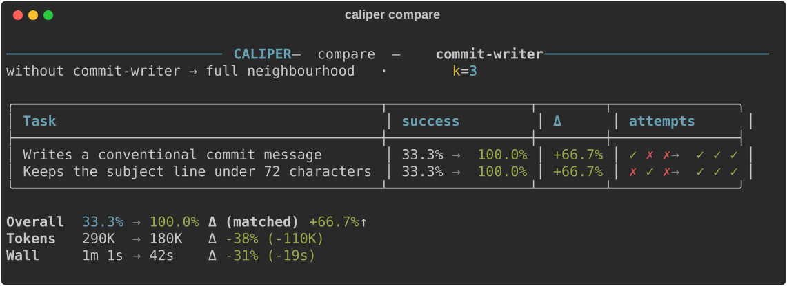

# Caliper: Know if your agent skill actually works

[](https://pypi.org/project/caliper-eval/)
[](https://pypi.org/project/caliper-eval/)
[](https://skills.sh/edonadei/caliper)

Your skill worked when you tried it. Will it work the next nine times? After the
next model update? When another skill competes for the same prompt?

Caliper runs your skill k times inside a real agent (**Claude Code, Codex, Pi, or
Hermes**) and gives you a **success rate** you can track. It installs the skill
the way a user would, so you learn two things separately: did the agent pick
your skill, and did the skill do the job.

Then run it again with the skill removed. If the bare agent scores the same,
your skill isn't earning its context.

**Let your agent run evals for you:**

```bash
npx skills@latest add edonadei/caliper
```

**Or run them yourself:**

```bash
pipx install caliper-eval   # requires Python 3.10+

# Run the eval: every task, 3 times each.
caliper run commit-writer.eval.yaml --k 3

# Same tasks, skill removed.
caliper run commit-writer.eval.yaml --k 3 --ablate commit-writer

# Did the skill make a difference? (`caliper list commit-writer` shows run IDs.)
caliper compare .caliper/results/commit-writer/<ablated-run>.json .caliper/results/commit-writer/<full-run>.json
```

`caliper compare` diffs the two runs task by task. In this illustrative example,
the skill takes both tasks from 33% to 100% and uses 38% fewer tokens than the
bare agent:

<!-- Terminal output of `caliper compare`, rendered to SVG so the box-drawing
     table stays aligned on every screen. Regenerate with:
       python docs/render_readme_samples.py -->


Each attempt is one agent session, so a 3-task spec at `--k 3` costs 9 sessions,
run 4 at a time by default.

---

## Why Caliper

Agent skills are hard to test. A skill that works on your machine, on this
prompt, today, can fail tomorrow after a model update or a one-line edit.

- **It tests the skill the way users hit it.** Caliper never pastes your skill
  into the prompt. It installs it where the agent looks for skills and lets the
  agent decide, so a run measures the `description` (does it fire?) and the body
  (does it work?) together.
- **It tells those two failures apart.** Activation gets its own scoreboard,
  separate from the success rate. A bad `description` and a bad body are fixed in
  different places, so one blended number would point at neither.
- **It puts your skill next to its neighbours.** Declare the other skills that
  might compete for a prompt, and assert which one should win.
- **It proves the skill is doing the work.** `--ablate` re-runs the same tasks
  without it, so you see what the skill adds over the bare agent.
- **It reports the honest number.** Caliper leads with how often a *single* run
  works, not `pass@k`, which flatters flaky skills (a 1-in-3 skill scores 70%).

Use Caliper to answer questions like:

- Does my skill still work on the new model?
- Did my edit improve the skill?
- Does my skill fire when it should, and stay quiet when it shouldn't?
- Is the skill worth the context, or would the base agent pass without it?
- Does it still pass the workflows it passed last week?
- Which agent (Claude Code, Codex, Pi, or Hermes) runs this skill more reliably?

---

## Quick start

### Path A: Let your agent drive

**1. Install the skills**

```bash
npx skills@latest add edonadei/caliper
```

This installs two skills: [`grill-skill`](#grill-skill-create-evals-interactively)
writes evals, and [`evaluate-skill`](#evaluate-skill-run-and-manage-evals) runs
them. `evaluate-skill` installs the Caliper CLI for you if it's missing.

**2. Generate a spec**

In your agent:

```text
/grill-skill ./commit-writer/SKILL.md
```

`grill-skill` reads your `SKILL.md`, interviews you, and writes a 3-task
`.eval.yaml` (happy path, edge case, adversarial).

**3. Run and measure**

```text
/evaluate-skill run commit-writer.eval.yaml --k 3
```

Browse past runs:

```text
/evaluate-skill list
/evaluate-skill report commit-writer
```

### Path B: Run the CLI yourself

**1. Install the CLI**

```bash
pipx install caliper-eval   # requires Python 3.10+
```

**2. Write a spec**

```yaml
# commit-writer.eval.yaml
skills:
  - ./SKILL.md                     # the skill under test
  - ../changelog-writer/SKILL.md   # a neighbour it might steal work from

tasks:
  # Autorater: the LLM judge reads the transcript and decides
  - name: Writes a conventional commit message
    setup: >-
      git init -q && git config user.name Eval && git config user.email eval@example.com
      && printf 'retry on 429\n' > NOTES.md && git add NOTES.md
    prompt: "Summarize the staged git diff as a commit message."
    expect: >
      The response is a conventional-commit message: a concise subject
      line under 72 characters, followed by a body explaining why the
      change was made, not just what changed.
    activates: [commit-writer]

  # Script execution: a deterministic Python assertion
  - name: Keeps the subject line under 72 characters
    setup: >-
      git init -q && git config user.name Eval && git config user.email eval@example.com
      && printf 'retry on 429\n' > NOTES.md && git add NOTES.md
    prompt: "Commit the staged changes."
    assert: |
      import subprocess
      subject = subprocess.run(
          ["git", "log", "-1", "--pretty=%s"],
          capture_output=True, text=True, check=True,  # no commit fails here
      ).stdout.strip()
      assert len(subject) <= 72, f"subject line is {len(subject)} chars"
    activates: [commit-writer]

  # Activation: this prompt belongs to the neighbour, not to you
  - name: A release summary belongs to changelog-writer
    prompt: "What changed since v2.1? I need it for the release notes."
    activates: [changelog-writer]
```

There are three kinds of check, and a task needs at least one:

- `expect:` is graded by an LLM judge.
- `assert:` runs locally as Python.
- `activates:` asserts which skills the agent chose to load.

The third task is the one you can't write any other way. Both skills read git
history, so a release-notes request is exactly where `commit-writer` might grab
work that belongs to `changelog-writer`. A task like that needs no `expect:`, so
it skips the judge and costs a fraction of a graded task.

The spec never names an engine. Both the skill and the judge run on
`claude-code` unless you pick another with `--model` / `--judge-model` (see
[Choosing an engine](#choosing-an-engine)).

**3. Run it**

```bash
caliper run commit-writer.eval.yaml --k 3
```

**4. Read the output**

![caliper run of commit-writer at k=3. Three rows: 'Writes a conventional commit message' passes 3/3 (100.0%, 80K tokens) with a green tick in the act column; 'Keeps the subject line under 72 characters' 2/3 (66.7%, PARTIAL, 84K tokens) with a green tick; 'A release summary belongs to changelog-writer' shows no execution score, a red cross in the act column, and reads 'trigger only'. Score 83.3% over 2 tasks scored. Activation 77.8% over 3 asserted tasks. A per-skill table shows, for each skill, how many of the 9 attempts wanted it and how often it fired: commit-writer was wanted on 6 of 9, fired on 6/6 of those (100.0%) but also on 2/3 of the attempts that did not want it (66.7%); changelog-writer was wanted on 3 of 9, fired on only 1/3 (33.3%), and never fired unwanted (0/6, 0.0%). commit-writer is taking prompts that belong to changelog-writer. Failure panels below show the assertion error and the attempts where commit-writer activated on the changelog prompt](docs/assets/run-output.svg)

Here the skill does its job (83%), but it also takes 2 of 3 release-notes
prompts that belong to `changelog-writer`. That's a `description` problem, not a
body problem.

The report ends with a panel for each failed attempt: the output, plus the
assertion or judge reason *why*. Full results are saved as JSON under
`.caliper/results/<spec>/`, for you to inspect or `caliper compare` later.
`--verbose` adds `pass@k` and `pass^k` columns and a panel for every task.

### Not sure what to put in a spec?

The **[Eval Starter Pack](examples/starter-pack/)** has four copy-paste
templates, each catching a real agent failure (false success, tool misuse,
runaway loops, prompt regressions). Every template runs green as-is against a
bundled example, then points at your own skill by editing two or three
commented lines.

---

## Recommended workflow

1. Create a spec for one behavior you care about.
2. Run with `--k 1` while iterating on the spec.
3. Add `assert:` for facts an LLM judge might guess wrong (files, JSON, command
   output).
4. Move to `--k 3` or higher once the task is stable.
5. Run once with `--ablate <skill>` (or `--ablate mcp:<server>`) and
   `caliper compare` the two runs, to prove the skill makes a difference. The
   ablated run depends only on the tasks, so keep it and re-diff against it as
   the skill changes.
6. Commit the spec alongside the skill so contributors can run the same eval.

---

## How it works

```
.eval.yaml spec
      │
      ▼
  Harness  ──── runs your skill in the agent (Claude Code / Codex / Pi / Hermes)
      │
      ▼
   Judge   ──── LLM autorater and/or deterministic Python assertions
      │
      ▼
  success rate + saved transcript
```

Each attempt runs in an isolated temporary home with no session history, in a
fresh empty working directory. It sees only the MCP servers the spec declares:
none of your personal servers, and none of the hosted connectors your Claude or
ChatGPT account carries (Gmail, Drive, GitHub, and the like). A spec's
`inherit_mcp: true` or the `--inherit-mcp` flag gives a run your own setup back;
the saved run records that it did. Results are saved as JSON you can inspect and diff later.

---

## Core concepts

| Term | What it is |
|---|---|
| **Spec** | A `.eval.yaml` file that describes the skills and tasks to run |
| **Backend** | The CLI agent that runs the skill (`claude-code`, `codex`, `pi`, `hermes`) |
| **Judge** | What decides pass/fail: an LLM reading the transcript (`expect:`), Python assertions (`assert:`), or both |
| **Success rate** | The primary score: run k times, measure how often a single run works |
| **Neighbourhood** | The set of skills a spec declares (`skills:`). All installed, none preloaded, and all assertable. This is the competition your `description` has to win |
| **Activation** | The agent *choosing* to load a skill. Asserted with `activates:` and scored on its own scoreboard, separate from the success rate |
| **Ablation** | Re-running the same tasks with a declared skill or `mcp:` server *removed* (`--ablate`), to prove it's doing the work |
| **Attempt** | One isolated run of a single task (fresh temporary home, no session history) |

The full glossary is in [docs/CONTEXT.md](docs/CONTEXT.md).

---

## Agent skills

### `evaluate-skill`: run and manage evals

Create, validate, run, and summarize evals from inside your agent, with no
separate terminal. In Claude Code:

```text
/evaluate-skill run commit-writer.eval.yaml --k 3
/evaluate-skill validate commit-writer.eval.yaml
```

In Codex:

```text
Use the evaluate-skill skill to run commit-writer.eval.yaml with k=3 and summarize the result.
```

### `grill-skill`: create evals interactively

`grill-skill` reads your `SKILL.md`, interviews you about what good behavior
looks like, and writes a 3-task spec. Then it runs the eval and loops: k=1 to
validate, k=3 to measure, and an ablated run to diff against before you commit.

```text
/grill-skill ./commit-writer/SKILL.md
```

Skip the path if you're already in the skill's directory. If an `.eval.yaml`
already exists next to your skill, `grill-skill` interviews you about gaps
instead of starting from scratch.

---

## Choosing an engine

The engine (backend + model) is picked at run time, not in the spec. The spec
describes *what* is tested and *how* success is judged; you pick the agent that
runs and grades it when you invoke Caliper. Both default to `claude-code`:

```bash
caliper run my-skill.eval.yaml                          # claude-code (default)
caliper run my-skill.eval.yaml --model codex            # codex, its default model
caliper run my-skill.eval.yaml --model codex:gpt-5.6-sol
caliper run my-skill.eval.yaml --model pi --judge-model claude-code
```

| Backend | Requires |
|---|---|
| `claude-code` | Claude Code CLI installed and authenticated |
| `codex` | Codex CLI (`npm install -g @openai/codex`), then `codex login` |
| `pi` | pi CLI (`npm install -g @earendil-works/pi-coding-agent`), authenticated |
| `hermes` | Hermes Agent CLI (Nous Research), authenticated, with a default model set |

The skill engine and judge engine are independent, so you can test a Codex skill
with a Claude judge. There's no direct-API backend: to use API billing, configure
one of these CLIs with an API key.

Setup details for each backend, the full `--model` syntax, and MCP support by
backend are in **[docs/backends.md](docs/backends.md)**.

---

## Spec format

The quick start covers the basics. A spec can also:

- pull neighbour skills from a **git repo**, pinned to a commit
  (`skills: - {repo: owner/name, ref: …, path: …}`)
- give the agent **MCP servers**, local or remote (`mcp:`)
- **use your own MCP setup** by default, for a connector no spec can declare
  (`inherit_mcp: true`; `--no-inherit-mcp` runs it isolated)
- run **`setup:` and `cleanup:`** shell hooks in each attempt's workdir
- extend `PATH` or **forbid files** the agent must not read (`sandbox:`)
- assert **silence** (`activates: []`) or a **delegation chain**
  (`activates: [mine, helper]`)

The full format, with every field, is in
**[docs/spec-reference.md](docs/spec-reference.md)**. To scaffold a spec, use
[`grill-skill`](#grill-skill-create-evals-interactively) or
[`evaluate-skill`](#evaluate-skill-run-and-manage-evals).

> **Upgrading an existing spec?** `skill:` became `skills:` in v0.10. See
> [docs/MIGRATING-to-skills.md](docs/MIGRATING-to-skills.md).

---

## CLI reference

| Command | Description |
|---|---|
| `caliper run <spec>` | Run an evaluation spec |
| `caliper validate <spec>` | Validate a spec file |
| `caliper list [spec]` | List specs and saved runs. Per spec, each row shows its **Run** ID and what that run **ablated**, which is how you find the run to diff against |
| `caliper report <spec-or-result>` | Re-render saved results |
| `caliper compare <A> <B>` | Diff two saved runs of the same eval, task by task. Each side is a spec name (that spec's **latest** run) or a results-JSON path; they must be two distinct runs |
| `caliper update-cli [backend]` | Check or update installed agent CLI versions |

Results are saved under the nearest `.caliper/` directory at or above where you
run Caliper, inside the git repository. See
[Where results are saved](docs/results.md#where-results-are-saved).

### `caliper run` flags

| Flag | Default | Description |
|---|---|---|
| `--k INT` | `3` | Attempts per task |
| `--ablate NAME` | none | Run without this declared skill or `mcp:` server (repeatable; name every skill for the bare agent). Qualify as `skill:`/`mcp:` when both declare the name |
| `--workers INT` | `4` | Attempts to run in parallel, across all tasks |
| `--timeout INT` | `120` | Seconds per attempt |
| `--fail-fast INT` | `0` | Stop a task after N consecutive `infra_error`/`timeout` attempts (`0` disables; counts attempts, not invocations) |
| `--model TARGET` | `claude-code` | Skill engine: `backend`, `model`, or `backend:model` ([syntax](docs/backends.md#selecting-an-engine)) |
| `--judge-model TARGET` | `claude-code` | Judge engine, same syntax |
| `--inherit-mcp` / `--no-inherit-mcp` | the spec's `inherit_mcp`, else off | Give attempts the MCP servers and account connectors your CLI loads by itself, merged with the spec's `mcp:` (the spec wins a name clash), or not. The judge stays isolated; no effect on `pi` ([details](docs/backends.md#inheriting-your-own-mcp-setup)) |
| `--verbose` | off | Show per-attempt judge reasoning |
| `--output PATH` | none | Also save results JSON to a specific path |

### Exit codes

| Code | Meaning |
|---|---|
| `0` | Ran, and nothing asked for a verdict said no |
| `1` | Bad input: spec not found, invalid spec, unresolvable skills, two references naming one run |
| `2` | Could not run cleanly: backend misconfiguration, an unavailable model, a retired flag, a failed setup/cleanup hook, or every attempt `infra_error`/`timeout`/`judge_error` |
| `3` | Reserved: ran cleanly, but a declared bar was not met |
| `130` | Interrupted with Ctrl-C; the partial run was saved |

`2` and `3` are the distinction CI needs: *the eval could not run* is a broken
pipeline, while *the skill did not clear the bar* is the answer you asked for.

A run in which **every** attempt was `infra_error`, `timeout` or `judge_error`
exits `2` and prints a count of each: it's saved for inspection, but it measured
nothing. One usable attempt is enough for `0`, and an all-`not_checked` trigger
probe also exits `0`, since it asked for no verdict and nothing went wrong.

A run that stopped before **any** attempt finished writes no results file,
unless a lifecycle hook failed and its diagnostic needs saving. Exits `2` and
`130` can therefore leave nothing on disk.

`caliper compare` deliberately never fails on a regression. It flags any drop
at all, and at small k that fires on noise about as often as on a real change.
Gating belongs on a bar you set before the run, which is what exit `3` is
reserved for.

---

## Scoring

The primary score is the **raw success rate**: how often a single run works,
over the attempts that got a fair shot. Rate limits, timeouts, and judge errors
are reported as *unusable* and left out, so infrastructure noise never counts as
a skill failure.

| The question you're asking | Metric | For a `1/3` skill (k=3) |
| --- | --- | --- |
| How reliable is a **single** run? *(default)* | **success rate** | `33%` |
| If I **retry** up to k times and keep any win, do I get one? | `pass@k` | `70%` |
| Will it work on **every** run, no exceptions? | `pass^k` | `4%` |

`pass@k` and `pass^k` appear under `--verbose`. Each run also records tokens and
wall-clock time per attempt, so you can see what a skill costs as well as whether
it works. Dollar cost isn't tracked, because it's inconsistent across backends.

Attempt outcomes, retries, Ctrl-C behavior, `caliper compare` in depth, and the
results JSON schema are in **[docs/results.md](docs/results.md)**.

---

## Troubleshooting

**`codex judge failed: model ... is not supported`**
The model isn't available to your Codex account. Use a model that
`codex exec --model <name>` accepts.

**`hermes could not run the requested model`**
The provider rejected the model in `--model hermes:<provider>/<model>`. Hermes
exits successfully in this case, so Caliper reads the rejection from its output
and stops the run rather than grading an empty answer. Check the model ID with
`hermes -z 'Reply OK' --model <model>`.

**`Judge model ... is unavailable` / `Judge authentication failed` / `Judge rate limited`**
The judge CLI reached the provider and the call was refused. Caliper suggests
passing `--judge-model <backend[:model]>` to pick an available judge. Example:
`caliper run my-skill.eval.yaml --judge-model claude-code:claude-haiku-4-5-20251001`.

- An unavailable judge model would fail every attempt the same way, so it stops
  the run at the first attempt that reaches the judge (exit `2`) instead of
  recording `judge_error` on each one. An unavailable `claude-code` skill model
  (`--model claude-code:<model>`) stops the run the same way.
- An authentication failure or a rate limit stays a per-attempt `judge_error`.
- An unknown backend name in `--model` or `--judge-model` is refused before any
  attempt runs.

**A task passes only because of `assert:`**
When a task has only `assert:`, no LLM judge runs. Add `expect:` if you also want
an LLM to evaluate the transcript.

**Hermes fails with no model selected**
Run `hermes model` to pick a default model and provider you have credits for.

---

## Contributing

Contributions are welcome. See [`CONTRIBUTING.md`](.github/CONTRIBUTING.md) for
good first areas, the pre-PR checklist, the ruff formatting convention and
pinned version, and the one-time `pre-commit install` step.
