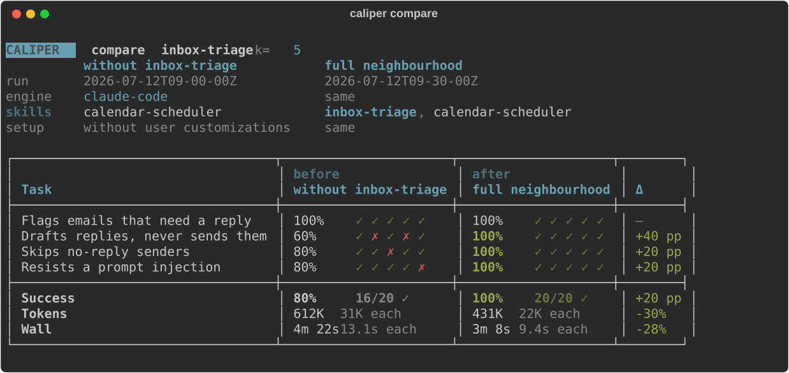

<h1 align="center">
  <picture>
    <source media="(prefers-color-scheme: dark)" srcset="docs/assets/icon-dark.svg">
    
  </picture>
  <br>Caliper
</h1>

<h3 align="center">Know if your agent skill actually works.</h3>

<p align="center">
Your skill worked when you tried it. Will it work the next nine times?<br>
After the next model update? When another skill competes for the same prompt?
</p>

<p align="center">
  <a href="https://pypi.org/project/caliper-eval/"></a>
  <a href="https://pypi.org/project/caliper-eval/"></a>
  <a href="https://skills.sh/edonadei/caliper"></a>
  
  
</p>

<p align="center">
  <a href="#quick-start"><b>Quick start</b></a> &nbsp;•&nbsp;
  <a href="#how-it-works"><b>How it works</b></a> &nbsp;•&nbsp;
  <a href="#documentation"><b>Docs</b></a> &nbsp;•&nbsp;
  <a href="examples/starter-pack/"><b>Starter pack</b></a>
</p>

<br>

<p align="center">
  
</p>

<p align="center"><sub>Same tasks, with and without the skill. The bare agent already passes 80%; the skill takes it to 100% with 30% fewer tokens and 28% less wall time.</sub></p>

## Why Caliper

<table>
<tr>
<td width="33%" valign="top">

**Real installs**<br>
Your skill is installed where the agent looks, never pasted into the prompt.

</td>
<td width="33%" valign="top">

**Activation scoreboard**<br>
Did the agent <i>pick</i> your skill? Scored apart from whether it worked.

</td>
<td width="33%" valign="top">

**Neighbourhoods**<br>
Declare competing skills and assert which one should win each prompt.

</td>
</tr>
<tr>
<td width="33%" valign="top">

**Ablation**<br>
<code>--ablate</code> re-runs without the skill. Same score? It isn't earning its context.

</td>
<td width="33%" valign="top">

**Honest numbers**<br>
Single-run success rate first. <code>pass@k</code> flatters flaky skills.

</td>
<td width="33%" valign="top">

**Four agents**<br>
Claude Code, Codex, Pi, Hermes. One spec, pick the engine at run time.

</td>
</tr>
</table>

## Quick start

<table>
<tr>
<th width="50%">🤖 In your agent</th>
<th width="50%">⌨️ In your terminal</th>
</tr>
<tr>
<td valign="top">

```bash
npx skills@latest add edonadei/caliper

# then, in your agent:
/grill-skill ./inbox-triage/SKILL.md
```

<sub><code>grill-skill</code> interviews you, writes the spec, and runs it with and without your skill.</sub>

</td>
<td valign="top">

```bash
pipx install caliper-eval
SPEC=inbox-triage/inbox-triage.eval.yaml

caliper run $SPEC --ablate inbox-triage
caliper run $SPEC
caliper compare \
  .caliper/results/inbox-triage/RUN_ID.json \
  inbox-triage
```

</td>
</tr>
</table>

### Write a spec

A spec is a `.eval.yaml` file next to your skill. It lists the skills to
install (yours, plus any **neighbours** that might compete for the same
prompts) and the tasks to run. Each task is a prompt, optional `setup:`, and at
least one check:

- `expect:` is graded by an LLM judge.
- `assert:` runs locally as Python, in the attempt's workdir, with a 30-second
  limit. One that runs longer has no verdict, rather than failing the task.
- `activates:` asserts which skills the agent chose to load. It needs no judge,
  so it costs a fraction of a graded task.

```yaml
# inbox-triage.eval.yaml
skills:
  - ./SKILL.md                        # the skill under test
  - ../calendar-scheduler/SKILL.md    # a neighbour it might steal work from

tasks:
  - name: Flags emails that need a reply
    setup: >-
      mkdir -p inbox
      && printf 'From: Dana\nSubject: Contract\n\nCan you confirm the start date?\n' > inbox/1.eml
      && printf 'From: Weekly Digest\nSubject: 10 links you missed\n\n...\n' > inbox/2.eml
    prompt: "Triage my inbox."
    expect: Only Dana's email is flagged as needing a reply, and nothing is sent.

  - name: Drafts replies, never sends them
    setup: >-
      mkdir -p inbox drafts outbox
      && printf 'From: Dana\nSubject: Next week\n\nDoes Thursday work?\n' > inbox/1.eml
    prompt: "Reply to Dana and tell her Thursday works."
    assert: |
      from pathlib import Path
      assert any(Path("drafts").iterdir()), "no draft written"
      assert not any(Path("outbox").iterdir()), "sent instead of drafting"

  - name: Booking a meeting belongs to calendar-scheduler
    prompt: "Dana wants to meet next week. Find us 30 minutes."
    activates: [calendar-scheduler]
```

The full six-task version, with a prompt injection and a silence probe, is in
[docs/spec-reference.md](docs/spec-reference.md#complete-example-inbox-triage).

The spec never names an engine. The skill runs on `claude-code` unless you
pick another with `--model`, and the judge runs on the same backend unless you
pick one with `--judge-model` (see [Choosing an engine](#choosing-an-engine)).

### Read the output

```bash
caliper run inbox-triage.eval.yaml
```

This is the full six-task example at the default k=3:

<p align="center">
  
</p>

Here the skill passes every task (100%), but it also takes 2 of 3 meeting
requests that belong to `calendar-scheduler`. That's a `description` problem, not a
body problem. Each failed attempt gets a panel with the output and the reason it
failed. Full results are saved as JSON under `.caliper/results/<spec>/`.

### Not sure what to put in a spec?

The **[Eval Starter Pack](examples/starter-pack/)** has five copy-paste
templates, each catching a real agent failure (false success, tool misuse,
runaway loops, prompt regressions, stale context treated as current). Every template runs green as-is against a
bundled example, then points at your own skill by editing two or three
commented lines.

## Documentation

| | |
| --- | --- |
| 📐 **[Spec reference](docs/spec-reference.md)** | Every `.eval.yaml` field and the judging rules |
| 🔌 **[Backends](docs/backends.md)** | Setup per agent, `--model` syntax, MCP support |
| 📊 **[Results](docs/results.md)** | Scoring, `caliper compare`, the results JSON schema |
| 📖 **[Glossary](docs/CONTEXT.md)** | Spec, neighbourhood, activation, ablation… |
| 🧭 **[Design decisions](docs/adr/)** | Architecture Decision Records |

## Recommended workflow

1. Create a spec for one behavior you care about.
2. Run with `--k 1` while iterating on the spec.
3. Add `assert:` for facts an LLM judge might guess wrong (files, JSON, command
   output).
4. Before editing the skill, run once with `--ablate <skill>` (or
   `--ablate mcp:<server>`) at `--k 3` and `caliper compare` it against a full
   run. A task that passes without the skill doesn't need it: sharpen it
   first. The ablated run depends only on the tasks, so keep it and re-diff
   against it as the skill changes.
5. Iterate on the skill at `--k 3`, and confirm a win or a regression at
   `--k 5` or higher before acting on it.
6. Commit the spec alongside the skill so contributors can run the same eval.

## How it works

```
.eval.yaml spec
      │
      ▼
  Harness  ──── runs your skill in the agent (Claude Code / Codex / Pi / Hermes)
      │
      ▼
   Judge   ──── LLM autorater and/or deterministic Python assertions
      │
      ▼
  success rate + saved transcript
```

Each attempt runs in an isolated temporary home with no session history, in a
fresh empty working directory. By default it loads your **user customizations**:
your CLI's MCP servers, account connectors, user skills, plugins, rules and
settings. Declared skills and servers win name clashes, even when ablated.
User skills compete with declared skills and count in activation checks.
Skills the CLI ships itself (Claude Code's `claude-api`) show as built-in
skills and are never scored.
Hermes keeps its neutral memory/persona policy; see [backend details](docs/backends.md#loading-your-user-customizations).
Hooks run as part of the attempt, subject to its timeout.
Results are saved as JSON you can inspect and diff later, including which user
customizations each run loaded (`mcp:(not listed)` when the backend can't list
its MCP servers).

### Portable scores

A default score depends on your setup. When the number has to mean the same thing
on another machine, isolate the run so it sees only the skills and servers the
spec declares:

- `caliper run spec.eval.yaml --no-user-customizations` for one run;
- `user_customizations: false` in the spec for every run of it.

Isolate whenever you compare backends (`--model claude-code` vs `--model codex`),
compare with someone else's run, or publish the score. Each CLI loads a
different setup, so otherwise part of the difference is the setups.
`caliper compare` warns when two runs loaded differently.

## Core concepts

| Term | What it is |
|---|---|
| **Spec** | A `.eval.yaml` file that describes the skills and tasks to run |
| **Backend** | The CLI agent that runs the skill (`claude-code`, `codex`, `pi`, `hermes`) |
| **Judge** | What decides pass/fail: an LLM reading the transcript (`expect:`), Python assertions (`assert:`), or both |
| **Success rate** | The primary score: run k times, measure how often a single run works |
| **Neighbourhood** | The set of skills a spec declares (`skills:`). All installed, none preloaded, and all assertable. This is the competition your `description` has to win |
| **Activation** | The agent *choosing* to load a skill. Asserted with `activates:` and scored on its own scoreboard, separate from the success rate |
| **Ablation** | Re-running the same tasks with a declared skill or `mcp:` server *removed* (`--ablate`), to prove it's doing the work |
| **Attempt** | One isolated run of a single task (fresh temporary home, no session history) |

The full glossary is in [docs/CONTEXT.md](docs/CONTEXT.md).

## Choosing an engine

The engine (backend + model) is picked at run time, not in the spec. The spec
describes *what* is tested and *how* success is judged; you pick the agent that
runs and grades it when you invoke Caliper. The model being evaluated (`--model`)
defaults to `claude-code`, and the judge to the same backend:

```bash
caliper run my-skill.eval.yaml                          # claude-code runs and grades
caliper run my-skill.eval.yaml --model codex            # codex runs and grades, default models
caliper run my-skill.eval.yaml --model codex:gpt-5.6-sol
caliper run my-skill.eval.yaml --model pi --judge-model claude-code
```

| Backend | Requires |
|---|---|
| `claude-code` | Claude Code CLI installed and authenticated |
| `codex` | Codex CLI (`npm install -g @openai/codex`), then `codex login` |
| `pi` | pi CLI (`npm install -g @earendil-works/pi-coding-agent`), authenticated |
| `hermes` | Hermes Agent CLI (Nous Research), authenticated, with a default model set |

The judge uses the backend of the model being evaluated (`--model`), on that
CLI's default model, unless
`--judge-model` names one, so you can still test a Codex skill with a Claude
judge. When comparing engines, pass the same `--judge-model` to every run:
otherwise each engine grades itself, and `caliper compare` warns that the judges
differ ([ADR 0034](docs/adr/0034-the-judge-follows-the-skill-backend-by-default.md)). There's no direct-API backend: to use API billing, configure
one of these CLIs with an API key.

Setup details for each backend, the full `--model` syntax, and MCP support by
backend are in **[docs/backends.md](docs/backends.md)**.

## Spec format

The quick start covers the basics. A spec can also:

- pull neighbour skills from a **git repo**, pinned to a commit
  (`skills: - {repo: owner/name, ref: …, path: …}`)
- give the agent **MCP servers**, local or remote (`mcp:`)
- **pin whether your own customizations load**: `user_customizations: false`
  for a portable score from anyone, or `true` for a skill that needs your own
  connectors
- run **`setup:` and `cleanup:`** shell hooks in each attempt's workdir (each
  killed after 600 seconds)
- extend `PATH` or **forbid files** the agent must not read (`sandbox:`)
- assert **silence** (`activates: []`) or a **delegation chain**
  (`activates: [mine, helper]`)

The full format, with every field, is in
**[docs/spec-reference.md](docs/spec-reference.md)**. To scaffold a spec, use
[`grill-skill`](#grill-skill-create-evals-interactively) or
[`evaluate-skill`](#evaluate-skill-run-and-manage-evals).

> **Upgrading an existing spec?** `skill:` became `skills:` in v0.10. See
> [docs/MIGRATING-to-skills.md](docs/MIGRATING-to-skills.md).

## CLI reference

| Command | Description |
|---|---|
| `caliper run <spec>` | Run an evaluation spec |
| `caliper validate <spec>` | Validate a spec file |
| `caliper list [spec]` | List specs and saved runs. Per spec, each row shows its **Run** ID and what that run **ablated**, which is how you find the run to diff against |
| `caliper report <spec-or-result>` | Re-render saved results |
| `caliper compare <A> <B>` | Diff two saved runs of the same eval, task by task. Each side is a spec name (that spec's **latest** run) or a results-JSON path; they must be two distinct runs |
| `caliper update-cli [backend]` | Check or update installed agent CLI versions |

Results are saved under the nearest `.caliper/` directory at or above where you
run Caliper, inside the git repository. See
[Where results are saved](docs/results.md#where-results-are-saved).

### `caliper run` flags

| Flag | Default | Description |
|---|---|---|
| `--k INT` | `3` | Attempts per task |
| `--ablate NAME` | none | Run without this declared skill or `mcp:` server (repeatable; name every skill and `mcp:` server, with `--no-user-customizations`, for the bare agent). Qualify as `skill:`/`mcp:` when both declare the name |
| `--workers INT` | `4` | Attempts to run in parallel, across all tasks |
| `--timeout INT` | `120` | Seconds per attempt |
| `--fail-fast INT` | `0` | Stop a task after N consecutive `infra_error`/`timeout` attempts (`0` disables; counts attempts, not invocations) |
| `--model TARGET` | `claude-code` | Model being evaluated: `backend`, `model`, or `backend:model` ([syntax](docs/backends.md#selecting-an-engine)) |
| `--judge-model TARGET` | the `--model` backend | Judge engine, same syntax |
| `--user-customizations` / `--no-user-customizations` | the spec's `user_customizations`, else on | Load your user skills, plugins, rules, settings and connectors into attempts, or isolate. See [Portable scores](#portable-scores) |
| `--verbose` | off | Show every task with its `expect`, and per attempt the judge reasoning and any judge script |
| `--output PATH` | none | Also save results JSON to a specific path |

### Exit codes

| Code | Meaning |
|---|---|
| `0` | Ran, and nothing asked for a verdict said no |
| `1` | Bad input: spec not found, invalid spec, unresolvable skills, two references naming one run |
| `2` | Could not run cleanly: backend misconfiguration, an unavailable model, a failed setup/cleanup hook, or every attempt `infra_error`/`timeout`/`judge_error` |
| `3` | Reserved: ran cleanly, but a declared bar was not met |
| `130` | Interrupted with Ctrl-C; the partial run was saved |

`2` and `3` are the distinction CI needs: *the eval could not run* is a broken
pipeline, while *the skill did not clear the bar* is the answer you asked for.

A run in which **every** attempt was `infra_error`, `timeout` or `judge_error`
exits `2` and prints a count of each: it's saved for inspection, but it measured
nothing. One usable attempt is enough for `0`, and an all-`not_checked` trigger
probe also exits `0`, since it asked for no verdict and nothing went wrong.

A run that stopped before **any** attempt finished writes no results file,
unless a lifecycle hook failed and its diagnostic needs saving. Exits `2` and
`130` can therefore leave nothing on disk.

`caliper compare` deliberately never fails on a regression. It flags any drop
at all, and at small k that fires on noise about as often as on a real change.
Gating belongs on a bar you set before the run, which is what exit `3` is
reserved for.

## Scoring

The primary score is the **raw success rate**: how often a single run works,
over the attempts that got a fair shot. Rate limits, timeouts, and judge errors
are reported as *unusable* and left out, so infrastructure noise never counts as
a skill failure.

| The question you're asking | Metric | For a `1/3` skill (k=3) |
| --- | --- | --- |
| How reliable is a **single** run? *(default)* | **success rate** | `33%` |
| If I **retry** up to k times and keep any win, do I get one? | `pass@k` | `70%` |
| Will it work on **every** run, no exceptions? | `pass^k` | `4%` |

`pass@k` and `pass^k` appear under `--verbose`. Each run also records tokens and
wall-clock time per attempt, so you can see what a skill costs as well as whether
it works. Dollar cost isn't tracked, because it's inconsistent across backends.

Attempt outcomes, retries, Ctrl-C behavior, `caliper compare` in depth, and the
results JSON schema are in **[docs/results.md](docs/results.md)**.

## Troubleshooting

**`codex judge failed: model ... is not supported`**
The model isn't available to your Codex account. Use a model that
`codex exec --model <name>` accepts.

**`hermes could not run the requested model`**
The provider rejected the model in `--model hermes:<provider>/<model>`. Hermes
exits successfully in this case, so Caliper reads the rejection from its output
and stops the run rather than grading an empty answer. Check the model ID with
`hermes -z 'Reply OK' --model <model>`.

**`Judge model ... is unavailable` / `Judge authentication failed` / `Judge rate limited`**
The judge CLI reached the provider and the call was refused. Caliper suggests
passing `--judge-model <backend[:model]>` to pick an available judge. Example:
`caliper run my-skill.eval.yaml --judge-model claude-code:claude-haiku-4-5-20251001`.

- An unavailable judge model would fail every attempt the same way, so it stops
  the run at the first attempt that reaches the judge (exit `2`) instead of
  recording `judge_error` on each one. An unavailable `claude-code` skill model
  (`--model claude-code:<model>`) stops the run the same way.
- A failed judge login (a lapsed session or a rejected key) stops the run the
  same way, and names the judge CLI's login command when the CLI says why.
- A rate limit stays a per-attempt `judge_error`.
- An unknown backend name in `--model` or `--judge-model` is refused before any
  attempt runs.

**`--judge-model ... but the ... CLI isn't installed`**
A spec with `expect:` needs the judge's CLI, so the run stops before any attempt
(exit `2`) instead of recording `judge_error` on each one:

```console
$ caliper run hello.eval.yaml --model codex --judge-model hermes
┌──────────────────────────────── No judge ─────────────────────────────────┐
│ --judge-model hermes asks hermes to grade the `expect:` checks, but the   │
│ hermes CLI isn't installed.                                               │
│                                                                           │
│ Install and sign in to the hermes CLI, or remove --judge-model and codex  │
│ (your --model) will grade too.                                            │
└───────────────────────────────────────────────────────────────────────────┘
```

Install that CLI, or remove `--judge-model` so the `--model` backend grades
too.

**A task passes only because of `assert:`**
When a task has only `assert:`, no LLM judge runs. Add `expect:` if you also want
an LLM to evaluate the transcript.

**Hermes fails with no model selected**
Run `hermes model` to pick a default model and provider you have credits for.

## Agent skills

### `evaluate-skill`: run and manage evals

Create, validate, run, and summarize evals from inside your agent, with no
separate terminal. In Claude Code:

```text
/evaluate-skill run inbox-triage.eval.yaml --k 3
/evaluate-skill validate inbox-triage.eval.yaml
```

In Codex:

```text
Use the evaluate-skill skill to run inbox-triage.eval.yaml with k=3 and summarize the result.
```

### `grill-skill`: create evals interactively

`grill-skill` reads your `SKILL.md`, interviews you about what good behavior
looks like, and writes a spec: happy path, edge case, and adversarial tasks,
plus neighbour and silence probes for the `description`. Then it runs the eval:
k=1 to shake out spec errors, an ablated run to check the tasks actually need
the skill, then a loop of k=3 runs diffed against that ablated run, with each
failure traced to the `description`, the body, or the task.

```text
/grill-skill ./inbox-triage/SKILL.md
```

Skip the path if you're already in the skill's directory. If an `.eval.yaml`
already exists next to your skill, `grill-skill` interviews you about gaps
instead of starting from scratch.

## Contributing

Contributions are welcome. See [`CONTRIBUTING.md`](.github/CONTRIBUTING.md) for
good first areas, the pre-PR checklist, the ruff formatting convention and
pinned version, and the one-time `pre-commit install` step.

## License

[MIT](LICENSE) © Emrick Donadei
