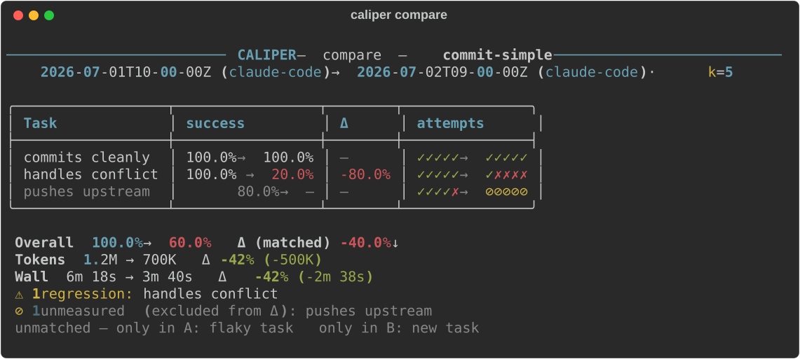

# Results, scoring, and comparison

What a run produces, how it's scored, and how to diff two runs. For the short
version, see [Scoring](../README.md#scoring) in the README.

## Where results are saved

Runs are saved under a **results root**: a directory with a `.caliper/` in it.
Every command resolves the same one: the nearest `.caliper/` at or above your
working directory, without leaving the git repository. The first run of a
project creates it at the repository root.

```
my-project/            <- .caliper/results/<spec>/<run id>.json lands here
├── .git/
├── .caliper/
└── evals/
    └── my.eval.yaml   <- `caliper run` from here finds the root above
```

So `caliper run evals/my.eval.yaml` and `caliper report my` agree wherever in the
project you run them from. To give a subdirectory its own history, such as a
package in a monorepo with its own eval suite, create the marker yourself:

```bash
mkdir .caliper
```

The nearest root wins, so everything under that directory files its runs there.
See [ADR 0022](adr/0022-saved-runs-live-at-a-discovered-results-root.md).

## Scoring

Every attempt carries a typed **outcome**, so infrastructure and judge noise
aren't scored as task failure:

| Outcome | Meaning | Counts toward the score? |
| --- | --- | --- |
| `pass` | satisfied the task's judge(s) | ✅ success |
| `task_fail` | the skill genuinely failed the task | ✅ attempt |
| `cheat` | a forbidden-file read was detected | ✅ attempt |
| `infra_error` | harness failure: nonzero exit, a detected rate limit or spending cap, or no model call observed (nothing parsed, no tokens) | ❌ unusable |
| `timeout` | exceeded the time budget with no result | ❌ unusable |
| `judge_error` | the judge produced no verdict (unparseable or errored autorater) | ❌ unusable |
| `not_checked` | the task has no `expect:`/`assert:`, so it's a trigger probe | ⊘ not asked |

An unavailable model, for the agent or the judge, isn't an outcome: it would
fail every attempt alike, so it stops the run with exit `2` instead.

`not_checked` is neither a result nor an error. It leaves the denominator like an
unusable attempt, but nothing went wrong, so it's never reported as an error and
its tokens aren't counted as wasted spend.

The primary metric is the **raw success rate**: how often a *single* run works,
computed over the **usable** attempts (the ones that got a fair shot). Unusable
attempts leave the denominator and are reported as a separate "N unusable"
count:

```
usable  = pass + task_fail + cheat
score   = successes / usable                # raw rate; None if usable == 0
```

Two secondary views are kept for anyone who wants them. They're shown under
`--verbose`, and on every task in the JSON as `pass_at_k` / `pass_hat_k`:

```
pass@k  = 1 - (1 - score) ^ usable   # P(≥1 of k passes)
pass^k  = score ^ usable             # P(all k pass)
```

**Which one to look at** depends on how the skill is used:

| The question you're asking | Metric | For a `1/3` skill (k=3) |
| --- | --- | --- |
| How reliable is a **single** run? *(default)* | **success rate** | `33%` |
| If I **retry** up to k times and keep any win, do I get one? | `pass@k` | `70%` |
| Will it work on **every** run, no exceptions? | `pass^k` | `4%` |

Use **`pass@k`** when retrying is cheap and you keep the winning run. It's the
optimistic view, always **≥** the raw rate. Use **`pass^k`** when the skill runs
unattended and one failure breaks the chain. It's the strict view, always **≤**
the raw rate. Caliper leads with the raw rate because `pass@k` flatters flaky
skills (`1/3 → 70.4%`).

The aggregate is the average task success rate, skipping tasks with no usable
attempts. To get a delta against the bare agent, run the same tasks with
`--ablate` and `caliper compare` the two saved runs.

### Setup and cleanup failures

A failed `setup:` records an `infra_error` attempt without running the agent or
judge, even if a previous attempt left files behind. `cleanup:` is attempted
after setup failure, agent failure, timeout, and interruption. A failed cleanup
doesn't change the measured outcome, but the report highlights it and
`caliper run` exits `2`.

Each hook failure is saved in `AttemptRecord.hook_failures` (when an attempt was
recorded) and in `RunMeta.hook_failures`, with task ID, attempt number, phase,
exit code, and captured output. The run-level list also keeps cleanup failures
from interrupted attempts that have no attempt record.

### Stopping early with `--fail-fast`

`--fail-fast N` stops scheduling new attempts for a task after N consecutive
`infra_error` or `timeout` outcomes (the default, `0`, runs all k). An
early-stopped task shows as `ABORTED`. If every completed attempt was unusable,
its `score` stays `null` and it's skipped in the aggregate.

## Parallelism and stopping a run

`--workers` counts **attempts**, not tasks. Every (task, attempt) pair is
scheduled independently, so `--k 10 --workers 4` on a one-task spec runs four
attempts at a time. They're ordered round-robin (attempt 1 of every task, then
attempt 2 of every task), so a run that stops early leaves a shallower sample of
*every* task rather than a complete sample of the first few.

The exception is `--fail-fast N`, which keeps each task's attempts in order,
because the streak it counts only means something sequentially. Different tasks
still run side by side.

Raise `--workers` deliberately: concurrent agents share your upstream rate
limit, and a throttled attempt lands as an `infra_error` that costs money and
measures nothing.

An interrupted run is marked wherever it's read: `caliper list` flags its score
with `⊘`, and `caliper compare` warns when either side stopped early, since a
shallower sample can move a delta on its own.

**A throttled attempt is retried, not counted.** When the provider answers 429,
overloaded, or 503, that invocation measured nothing, so Caliper retries it
twice (2s then 4s, jittered) and records the result as **one** attempt with a
`retries` count. The score's denominator is attempts, never spawns. A run that
retried anything says so under its usage summary. Two failures are deliberately
*not* retried: a timeout (nothing says the next spawn is faster) and a bare crash
(retrying would hide a defect that reproduces). `--fail-fast` counts
attempts, not spawns, so a streak of N can cost up to 3N spawns.

**A spending cap stops the run.** A cap or usage limit won't clear before the
last attempt, so Caliper aborts instead of spending every remaining attempt
hitting the same wall. It saves what already ran and reports the cap as the
cause.

**Ctrl-C stops a run without losing it.** The first interrupt kills the agents in
flight, skips attempts that hadn't started, and saves everything that already
ran as an ordinary run file. It's scored over the attempts it has, with
`interrupted: true` in `RunMeta` and an `interrupted:` line on the report. The
exit code is `130`. Attempts the interrupt itself killed are dropped rather than
recorded as failures. Press Ctrl-C again to quit immediately without saving. A
fatal backend error mid-run (an expired credential, say) saves the same way
before reporting the error.

## Comparing two runs (`caliper compare`)

`caliper compare <A> <B>` diffs two saved runs of the *same* eval, task by task.
Use it for an ablation (the skill removed vs present), a full skill against a
shortened variant, or the same skill at two points in time.

```bash
# Latest run of each spec (a bare spec name resolves to its latest run)
caliper compare commit-simple-full commit-simple-short

# Pin specific runs by pointing at their results JSON
caliper compare .caliper/results/demo/2026-07-01T10-00-00Z.json \
                .caliper/results/demo/2026-07-02T09-00-00Z.json

# Machine-readable diff for a ship / no-ship decision
caliper compare A B --format json
```

Each positional (`A`, `B`) is addressed exactly like `report`'s argument: a spec
name (which resolves to its latest run) or a path to a results JSON. To pin a
historical run, name its JSON path. `caliper list <spec>` shows each run's ID and
what it ablated.

<!-- Terminal output of `caliper compare`, rendered to SVG so the box-drawing
     table stays aligned on every screen. Regenerate with:
       python docs/render_readme_samples.py -->


How to read the diff:

- **Each row reads `before → after`.** The runs are named once in the header (an
  ablation pair is titled `without <subject> → full neighbourhood`), so there's
  no A/B legend.
- **Tasks are matched by name**, so reordering doesn't matter. A task in only one
  run is listed as **unmatched** and left out of the delta.
- **`Δ` is `after − before`.** The headline `Δ (matched)` averages only the tasks
  measured on both sides, so it stays like-for-like. A negative Δ renders red and
  flags a **regression**.
- **Unusable attempts can't fake a loss.** A side with no usable attempts (rate
  limit, timeout, judge error) shows `—` and never counts as a regression.
- **Token and wall-clock deltas are secondary** and never a regression: a drop is
  green (cheaper), a rise red (a trade-off to weigh). Only the score feeds
  `has_regression`.
- **A different tool environment warns.** Two runs configured with different
  `mcp:` servers, where only one loaded your user customizations, or both did on
  different setups, get a warning in the header saying how to match them: tool
  availability can move the score for reasons unrelated to the skill. Two
  different backends with user customizations warn too, since each CLI loads its
  own setup; isolate both runs (`--no-user-customizations`) for a harness comparison.

`--format json` serializes the full comparison (per-task scores, deltas,
regression flags, unmatched lists, warnings, `skill_drift`, and per-side usage)
for scripting. Each `skill_drift` entry carries the member's `name`,
`source_kind`, and the two sides' `a_ref`/`b_ref`, so a script sees drift for
*every* member, including path sources that don't raise a warning.

`caliper compare` deliberately doesn't set a failing exit code on a regression.
It flags any drop at all, however small, and at small k that fires on noise
about as often as on a real change. Gating a pipeline belongs on a bar you set
*before* the run, which is what `caliper run`'s exit code `3` is reserved for.

## Token and time usage

The success rate tells you *whether* a skill works; usage tells you what it
**costs**. Two runs can score the same while one burns twice the tokens. Caliper
records **token volume** and **wall-clock time** per attempt and rolls them up
per run. Judge latency is recorded separately as `judge_seconds` and summarized
on its own `Judge` line. It isn't part of `Wall`, which stays the agent's own
time, and it only appears when a judge ran.

```
 With skill    100.0%  ████████████████████

 Tokens   1.2M in / 340K out
 Wall     6m 18s  12.6s per attempt
 ⊘ unusable spend: 180K tokens, 42s  (2 attempts, not counted in the average)
```

- The results table has per-task `Tokens` and `Wall` columns, so you can spot the
  expensive task at a glance. The summary line aggregates the whole run.
- In the summary, **`in` = input + cache_read + cache_creation** and **`out` =
  output**. The **unusable** slice (timeout, infra error, judge error) is broken
  out separately, so wasted spend stays visible without distorting the
  per-attempt average.
- **Support:** `claude-code`, `codex`, `pi`, and `hermes` all report usage. A
  backend that can't leaves the fields `null` and renders `—`. `codex` includes
  cache in its `input_tokens`, so it's normalized to the non-cached contract
  below.
- **Dollar cost is deliberately not tracked**, because it's inconsistent across
  backends. Tokens are the volume signal; derive a dollar figure downstream if
  you need one.
- **An ablated run is an ordinary saved run**, so the ablated-vs-full view is
  `caliper compare` like any other diff: same table, attempt strips, and
  token/wall deltas.

## Results JSON

### Usage and transcript fields

- Each `AttemptRecord` has an optional `usage` object that splits tokens four
  ways:
    - `input_tokens`: prompt, excluding cache
    - `output_tokens`: generated output
    - `cache_read_tokens`: cache hits
    - `cache_creation_tokens`: cache writes

  The four are **disjoint**, so the computed `total_tokens` never double-counts.
  Wall-clock time comes from `duration_seconds`.
- Each `AttemptRecord` also has an optional `transcript` array of ordered turns
  (`role`, `content`, and `tool_name`/`tool_input`/`tool_output` when present).
  It preserves the full tool-call trace for later inspection. Older JSON without
  the field still loads (`transcript` is `null`).
- Each `SkillSnapshot` records `source_kind` (`"path"` or `"git"`) alongside
  `git_repo`/`git_sha`, so a saved run says how each member of the neighbourhood
  was obtained and, for a git source, the exact commit. Older JSON without the
  field still loads and reads as `"path"`.
- `report --format json` adds a derived `usage_totals` block. The saved JSON
  keeps the raw per-attempt `usage`; totals are always derived, never persisted.

### Activation fields

- Each `AttemptRecord` has `activated`: the skills the agent chose to load,
  recorded on every attempt whether or not the task asserted on it. It's `null`
  when nothing was *observable*: an attempt with the whole neighbourhood ablated
  (no skills installed), or a timeout or infra failure whose truncated transcript
  showed no activation. A bare `[]` in those cases would falsely claim "the
  description never fired", so Caliper never writes one.
- A truncated transcript that *did* show an activation **keeps** it: truncation
  can hide evidence, never invent it. The attempt still stays out of the
  activation score (that denominator excludes `timeout` and `infra_error`), and
  its `activation_passed` is `null`: an observation, never a verdict. See
  *Activation admissibility* in [CONTEXT.md](CONTEXT.md).
- `activation_passed` is the verdict: `null` means **not asserted** (a different
  `null` from `activated`'s, matching the existing `assert_passed` idiom).
- `TaskResult` has `activation_expected` (the task's `activates:` set) plus
  derived `activation_usable` / `activation_successes` / `activation_score`.
- `AggregateScore` has `avg_activation_score`, `activation_tasks`, and
  `activation_per_skill` (per-skill `expected`/`fired`/`hits` with derived
  `recall`/`precision`), alongside `scored_tasks` for the execution half.
- `RunMeta.era` records how skills were loaded when the run was made. Runs saved
  before Caliper switched to install-and-discover
  ([ADR 0013](adr/0013-install-and-discover-is-the-only-loading-discipline.md))
  have no era, and **`caliper compare` refuses** to diff across that boundary,
  because those runs measured something else. A *neighbourhood* change between
  two runs of the same era only warns.
- `RunResults.skill_snapshots` is a list, one snapshot per declared skill, since
  a neighbour's `description` is part of what produced the score. Older runs
  carry a singular `skill_snapshot`; they still load, and their missing era is
  what makes `compare` refuse them.
- `RunMeta.mcp_servers` records the `mcp:` servers a run was configured with,
  after any ablation. Together with `RunMeta.ablated`, it lets `compare` check an
  `mcp:` label against what the run actually had, so a spec that dropped a server
  between two runs isn't misread as an ablation of it. It's `None` on a run saved
  before the field existed (unknown, not "none"), and `compare` warns
  (`mcp_mismatch`) when two runs recorded different servers.
- `RunMeta.user_customizations` records whether the run loaded the machine's user
  customizations (the default; `false` when isolated, and on runs saved before the
  field existed), and
  `RunMeta.loaded_user_customizations` the names the backend could identify,
  with kind prefixes: `mcp:gmail`, `skill:personal`, `plugin:review@market`,
  `rules:CLAUDE.md`, `settings:config.toml`. Declared names are excluded.
  `None` means unknown, including when Codex's hosted plugins prevent a complete
  inventory; a partial inventory is not presented as complete. Loaded user
  servers never appear in `mcp_servers`. `compare` warns (`user_customizations_mismatch`) when only one side
  loaded, or both did with different recorded customization names, and
  (`cross_backend_user_customizations`) when two backends are compared with user customizations.
  Names are compared as sets; file contents, versions and hook behavior are not
  fingerprinted. Older unprefixed inventories still load and conservatively
  differ from new prefixed inventories. User-skill activations appear in the
  attempt's `activated` list and participate in exact-set checks.
  Two runs form an ablation pair only if their recorded customizations agree
  ([ADR 0028](adr/0028-runs-load-user-customizations-by-default.md)).
- `TaskComparison` has `a_activation`/`b_activation`/`activation_delta`/
  `activation_regression`, and `RunComparison` has `has_activation_regression`,
  kept strictly separate from `has_regression`.
